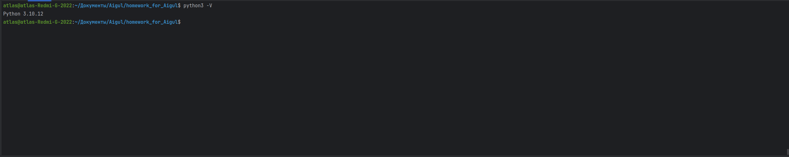
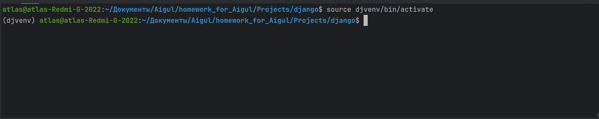

### Django

## Task 1

### Установка PyCharm
```bash
sudo snap install pycharm-community --classic
```
## Установка Far Manager
### Установка wime для работы с Far Manager
```bash
sudo apt install wine
```
### Загрузка Far Manager
```bash
wget https://www.farmanager.com/Far30b.x64.20240510.msi
```

## Task 2

### Установка python

```bash
sudo apt update
sudo apt install python3 python3-pip
```
Успешность установки Python можно проверить выполнив следующую команду
### Версия python
```bash
python3 -V
```


### Просмотр списка установленных пакетов
```bash
pip list
```
### Создание репозитория в котором будет установленно виртуальное окружение
```bash
mkdir Projects Projects/django
cd Projects/django
```
### Запуск PyCharm
```bash
pycharm-community
```
### Создание и запуск виртуального окружения
```bash
python3 -m venv djvenv
source djvenv/bin/activate
```
При успешном выполнении появится надпись "djvenv"

### Команда для выхода из виртуального окружения
```bash
deactivate
```
# При просмотре установленных пакетов внутри виртуального окружения мы увидим всего два пакета
```bash
pip list
```
## Установка Django
```bash
pip install django==4.2.1
```
# При просмотре установленных пакетов теперь будут добавлены дополнительные пакеты
```bash
pip list
```
# Просмотр команд ядра
```bash
gjango-admin
```
## Создание сайта
#django-admin startproject <site_name>
```bash
django-admin startproject sitewomen
cd sitewomen
```
# Применение маграции к базе данных
python manage.py migrate

# Запуск тестового web-сервера
```bash
python manage.py runserver
```

# TASK 3

# Создание первого приложения
```bash
python manage.py startapp women
```
### Регстрация приложения в проекте сайта
```python
INSTALLED_APPS = [
    'django.contrib.admin',
    'django.contrib.auth',
    'django.contrib.contenttypes',
    'django.contrib.sessions',
    'django.contrib.messages',
    'django.contrib.staticfiles',
    'women',
]
```
### Для того чтобы каждый раз не конкретизировать путь в приложению
```python
INSTALLED_APPS = [
    'django.contrib.admin',
    'django.contrib.auth',
    'django.contrib.contenttypes',
    'django.contrib.sessions',
    'django.contrib.messages',
    'django.contrib.staticfiles',
    'women.apps.WomanConfig',
]
```
# TASK $
### Создание функции представления, которая будет обрабатывать главную страницу
./women/views.py
```python
def index(request):
    return HttpResponse("Страница приложения women.")
```
request – это ссылка на
экземпляр класса HttpRequest, который содержит информацию о запросе, о
сессии, куках и так далее

* сайт не будет работать так как не подключена библиотека
```python
from django.http import HttpResponse
```

### Связывание функции представления с соответствующим URL-фдресом
./sitewomen/sitewomen/urls.py
```python
from django.contrib import admin
from django.urls import path
from women.views import index

urlpatterns = [
    path('admin/', admin.site.urls),
    path('women/', index),
]
```
первый параметр – это суффикс URL-адреса, то есть, часть URL, которая
добавляется после доменного имени

### Создание функции представления, которая будет отображать список статей по рубрикам
./women/views.py
```python
def categories(request):
    return HttpResponse("<h1>Статьи по категориям</h1>")
```
Мы здесь используем тег h1, чтобы браузер отобразил эту строку как заголовок
первого уровня. Затем, добавляем еще один путь в список urlpatterns:

### Связывание функции представления с соответствующим URL-фдресом
./sitewomen/sitewomen/urls.py
```python
from django.contrib import admin
from django.urls import path
from women.views import index

urlpatterns = [
path('admin/', admin.site.urls),
path('women/', index),
path('cats/', categories),
]
```
первый параметр – это суффикс URL-адреса, то есть, часть URL, которая
добавляется после доменного имени
### Более удобный способ импорта нужных функций
```python
from django.contrib import admin
from django.urls import path
from women import views

urlpatterns = [
    path('admin/', admin.site.urls),
    path('women/', views.index),
    path('cats/', views.categories),
]
```

### Оптимизация передачи маршрутов
```python
from django.contrib import admin
from django.urls import path, include
from women import views

urlpatterns = [
    path('admin/', admin.site.urls),
    path('', include('women.urls')),
]
```

### Создание URL-маршрутов для оптимизации
```bash
touch women/urls.py
```

```python
from django.urls import path
from women import views

urlpatterns = [
    path('', views.index),
]
```

```python
urlpatterns = [
    path('', views.index),
    path('cats/', views.categories),
]
```

# TASK 6
./sitewoman/urls.py
```python
def categories(request, cat_id):
    return HttpResponse(f"<h1>Статьи по категориям</h1><p >id:{cat_id}</p>")
```
./woman/urls.py
```python
from django.urls import path
from women import views

urlpatterns = [
    path('', views.index),
    path('cats/<int:cat_id>/', views.categories),
]
```
Изменим статьи по категориям
```python
from django.shortcuts import render
from django.http import HttpResponse

# Create your views here.
def index(request):
    return HttpResponse("Страница приложения women.")

def categories(request, cat_id):  # Убрать значение по умолчанию для cat_id
    return HttpResponse(f"<h1>Статьи по категориям</h1><p>id: {cat_id}</p>")

def categories_by_slug(request, cat_slug):
    return HttpResponse(f"<h1>Статьи покатегориям</h1><p >slug:{ cat_slug }</p>")
```


Добавление регулярных выражений
```python
from django.contrib import admin
from django.urls import path, include, re_path
from women import views  # Импорт views из приложения women

urlpatterns = [
    path('admin/', admin.site.urls),
    path('', include('women.urls')),
    
    re_path(r'^archive/(?P<year>[0-9]{4})/$', views.archive),
]
```

```python
def archive(request, year):
    return HttpResponse(f"<h1>Архив по годам</h1><p>{year}</p>")
```
```python
from django.urls import path, register_converter
from . import converters, views

register_converter(converters.FourDigitYearConverter, 'year4')

urlpatterns = [
    path('', views.index),
    path('archive/<year4:year>/', views.archive),
    path('cats/<int:cat_id>/', views.categories),
    path('cats/<slug:cat_slug>/', views.categories_by_slug),
]
```

# TASK 7