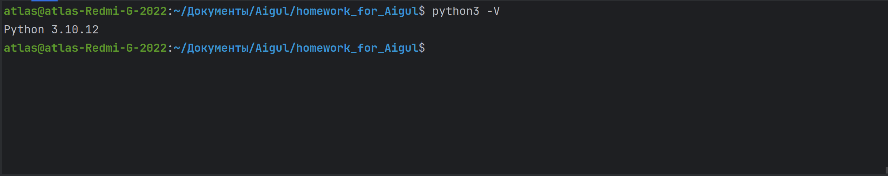

### Django

## Task 1

### Установка PyCharm
```bash
sudo snap install pycharm-community --classic
```
## Установка Far Manager
### Установка wime для работы с Far Manager
```bash
sudo apt install wine
```
### Загрузка Far Manager
```bash
wget https://www.farmanager.com/Far30b.x64.20240510.msi
```

## Task 2

### Установка python

```bash
sudo apt update
sudo apt install python3 python3-pip
```
Успешность установки Python можно проверить выполнив следующую команду
### Версия python
```bash
python3 -V
```


### Просмотр списка установленных пакетов
```bash
pip list
```
### Создание репозитория в котором будет установленно виртуальное окружение
```bash
mkdir Projects Projects/django
cd Projects/django
```
### Запуск PyCharm
```bash
pycharm-community
```
### Создание и запуск виртуального окружения
```bash
python3 -m venv djvenv
source djvenv/bin/activate
```
При успешном выполнении появится надпись "djvenv"

### Команда для выхода из виртуального окружения
```bash
deactivate
```
# При просмотре установленных пакетов внутри виртуального окружения мы увидим всего два пакета
```bash
pip list
```
## Установка Django
```bash
pip install django==4.2.1
```
# При просмотре установленных пакетов теперь будут добавлены дополнительные пакеты
```bash
pip list
```
# Просмотр команд ядра
```bash
gjango-admin
```
## Создание сайта
#django-admin startproject <site_name>
```bash
django-admin startproject sitewomen
cd sitewomen
```
# Применение маграции к базе данных
#python manage.py migrate